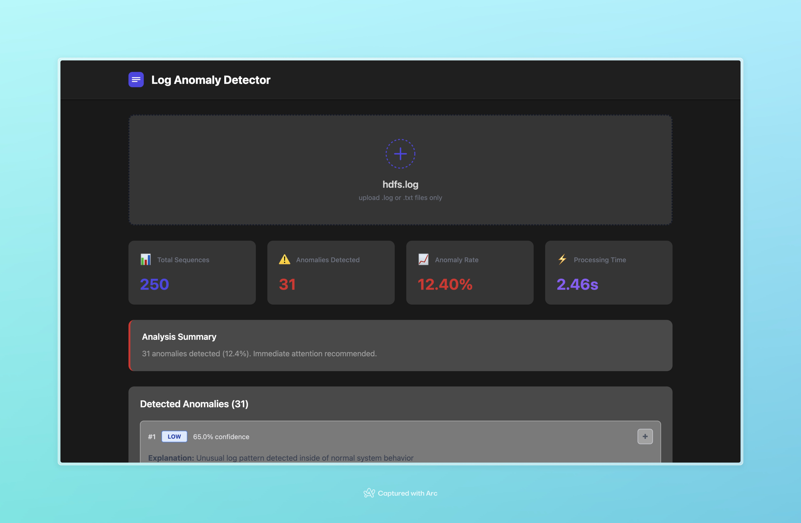
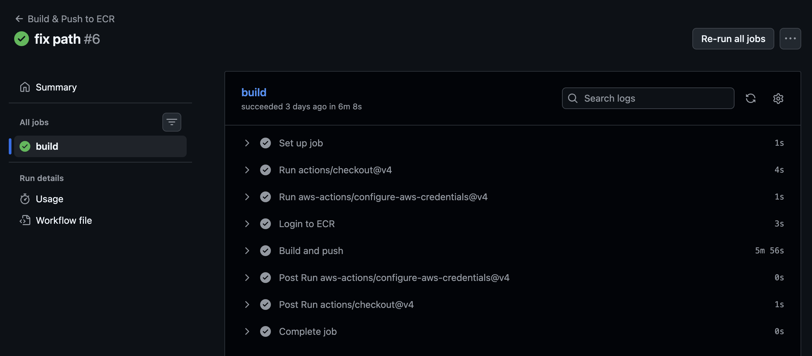
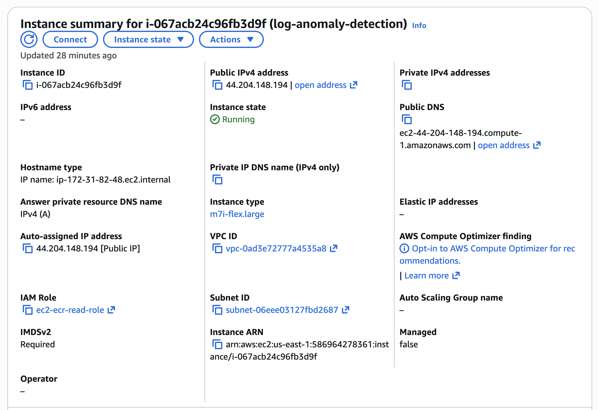
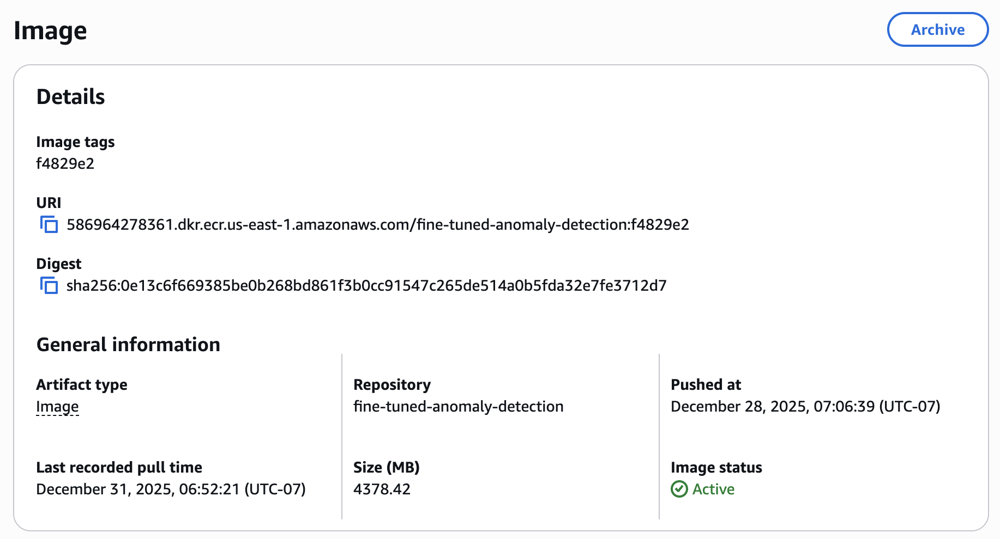
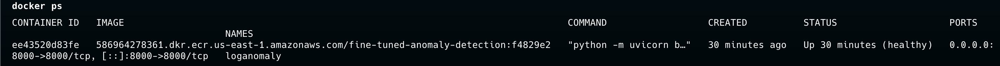

# Log Anomaly Detection System

A system for detecting anomalies in distributed system logs using fine-tuned transformer models with explainable AI.



## Overview

This project implements an intelligent anomaly detection system for analyzing log files from distributed systems (HDFS). Unlike traditional rule-based approaches, it uses **dual transformer models** to not only detect anomalies but also provide human-readable explanations for each detection.

## 🏗️ Architecture

```
┌─────────────────┐
│   React UI      │  ← User uploads log file
└────────┬────────┘
         │
         ▼
┌─────────────────┐
│  FastAPI Server │  ← REST API endpoint
└────────┬────────┘
         │
         ▼
┌─────────────────────────────────────────┐
│         Log Preprocessing               │
│  • Parse log format                     │
│  • Create sliding windows               │
│  • Batch sequences                      │
└────────┬────────────────────────────────┘
         │
         ▼
┌─────────────────────────────────────────┐
│      DeBERTa Classifier (Model 1)       │
│  • Binary classification                │
└────────┬────────────────────────────────┘
         │
         ▼
    Anomaly?
         │
    ┌────┴────┐
    │   Yes   │
    └────┬────┘
         │
         ▼
┌─────────────────────────────────────────┐
│      FLAN-T5 Explainer (Model 2)        │
│  • Generate natural language            │
│  • Explain WHY it's anomalous           │
│  • Context-aware reasoning              │
└────────┬────────────────────────────────┘
         │
         ▼
┌─────────────────┐
│   JSON Response │  ← Anomalies + explanations
└─────────────────┘
```

### Why Dual Models?

**DeBERTa (Classifier)**

- Fast binary classification: anomaly vs. normal
- 99.9% precision on training data
- Optimized for speed with LoRA

**FLAN-T5 (Explainer)**

- Generates human-readable explanations
- Only runs on detected anomalies
- Provides actionable insights for operators

## Features

### Functionality

- **Automated anomaly detection** in HDFS logs
- **Explainable AI** - Natural language explanations for each anomaly
- **Batch processing** - Efficient handling of large log files (10K+ lines)
- **Severity classification** - High/Medium/Low risk levels

### Technical Features

- **Automated CI/CD** - GitHub Actions → AWS ECR → EC2
- **Docker containerization** - Consistent environments
- **Comprehensive API** - RESTful endpoints with OpenAPI docs
- **Interactive dashboard** - Real-time visualization
- **Error handling** - Graceful failures with detailed messages
- **Health monitoring** - Built-in health check endpoints

## Performance Metrics

Measured on NVIDIA A100 80GB GPU with 24GB RAM:

| Metric              | Value     | Description                    |
| ------------------- | --------- | ------------------------------ |
| **P50 Latency**     | 90.3ms    | Median response time           |
| **P95 Latency**     | 94.3ms    | 95th percentile                |
| **P99 Latency**     | 100.7ms   | 99th percentile                |
| **Throughput**      | 310 seq/s | Sequences processed per second |
| **Model Precision** | 99.9%     | On HDFS training data          |
| **F1 Score**        | 80.1%     | Balanced performance           |

## Tech Stack

### Backend

- **Framework**: FastAPI (Python 3.10)
- **ML Libraries**: PyTorch, Transformers, PEFT (LoRA)
- **Models**:
  - microsoft/deberta-v3-base (classifier)
  - google/flan-t5-base (explainer)

### Frontend

- **Framework**: React

### Infrastructure

- **Cloud**: AWS (EC2 m7i-flex.large)
- **Container Registry**: AWS ECR
- **CI/CD**: GitHub Actions
- **Containerization**: Docker

## Getting Started

### Prerequisites

```bash
Python 3.10+
Docker 20.10+
CUDA 11.8+ (for GPU training)

Node.js 18+
Git
AWS CLI
```

### Local Development Setup

1. **Clone the repository**

```bash
git clone https://github.com/yourusername/log-anomaly-detection.git
cd log-anomaly-detection
```

2. **Set up Python environment**

```bash
python -m venv loganomaly
source loganomaly/bin/activate
pip install -r backend/requirements.txt
```

3. **Download pre-trained models**

```bash
mkdir -p ml/models/classifier/final
mkdir -p ml/models/reasoning/final
```

4. **Start the backend server**

```bash
cd backend
uvicorn main:app --reload --host 0.0.0.0 --port 8000
```

5. **Start the frontend**

```bash
cd ui
npm install
npm start
```

6. **Test the API**

```bash
curl http://localhost:8000/health
```

### Docker Deployment

```bash
docker build -t log-anomaly-detector .

docker run -p 8000:8000 --gpus all log-anomaly-detector

curl http://localhost:8000/health
```

## Model Training

Training was performed on NVIDIA A100 80GB GPU:

### Dataset

- **Source**: HDFS logs from Hadoop Distributed File System
- **Size**: 100,000+ log sequences
- **Split**: 80% train, 20% validation
- **Preprocessing**: Sliding window (size=10, stride=5)

### Training Configuration

```python
Epochs: 10
Batch Size: 32
Learning Rate: 2e-5
LoRA Rank: 16
LoRA Alpha: 32

Epochs: 8
Batch Size: 32
Learning Rate: 2e-5
Max Length: 512
```

### Training Process

```bash
python ml/log_preprocessor.py

python ml/train.py

```

### Training Results

- **Training Time**: ~6 hours (classifier) + ~4 hours (reasoning)
- **GPU Memory**: ~45GB peak usage
- **Final Loss**: 0.06
- **Best F1**: 80.1%

## Deployment

### AWS Architecture

```
GitHub → GitHub Actions → AWS ECR → AWS EC2
```

### CI/CD Pipeline

The project uses GitHub Actions for automated deployment:

1. **Trigger**: Push to `main` branch
2. **Build**: Docker image with all dependencies
3. **Test**: Run unit and integration tests
4. **Push**: Upload to AWS ECR
5. **Deploy**: Pull and run on EC2 instance

**Image Size**: 4.3GB

## API Documentation

### Endpoints

#### `GET /health`

Health check endpoint

```bash
curl http://44.204.148.194:8000/health
```

**Response:**

```json
{
  "status": "healthy",
  "models_loaded": true,
  "device": "cuda",
  "timestamp": "2025-01-01T12:00:00"
}
```

#### `POST /analyze`

Analyze log file for anomalies

**Request:**

```bash
curl -X POST http://44.204.148.194:8000/analyze \
  -F "file=@hdfs.log"
```

**Response:**

```json
{
  "status": "success",
  "total_sequences": 250,
  "anomalies_detected": 31,
  "anomaly_rate": 0.124,
  "processing_time": 2.46,
  "summary": "31 anomalies detected (12.4%). Immediate attention recommended.",
  "results": [
    {
      "sequence_id": 42,
      "confidence": 0.892,
      "severity": "high",
      "explanation": "Multiple ERROR messages indicate recurring system issues",
      "log_snippet": "[ERROR] org.apache.hadoop.hdfs: Connection timeout..."
    }
  ]
}
```

#### `GET /stats`

Get model statistics and configuration

**Response:**

```json
{
  "model_info": {
    "classifier": {
      "name": "DeBERTa-v3-base",
      "precision": 0.999,
      "recall": 0.669,
      "f1_score": 0.801
    }
  },
  "config": {
    "window_size": 5,
    "stride": 5,
    "max_file_size_mb": 50,
    "device": "cuda"
  }
}
```

## Screenshots

### CI/CD Pipeline



### AWS Infrastructure





### Application Interface


### Docker Process



---
