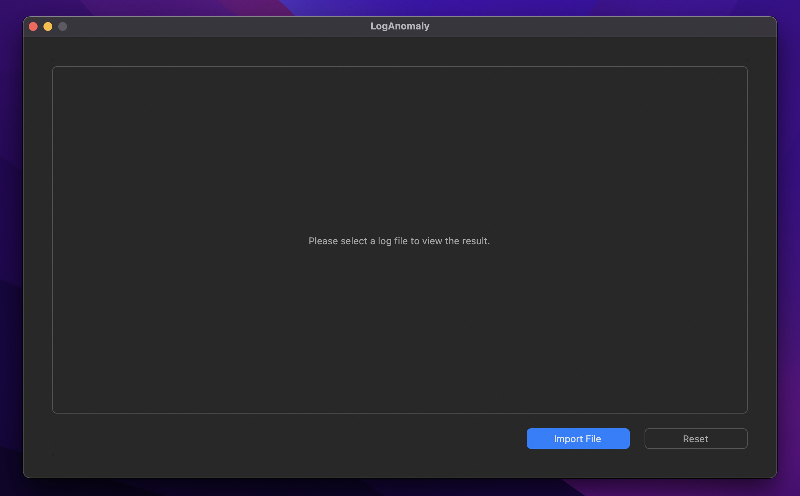
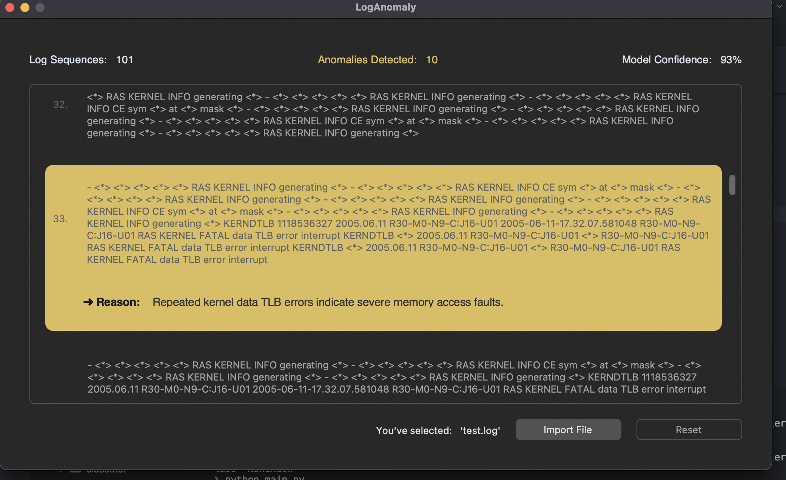

# System Logs Anomaly Detection using Fine-Tuned LLMs

Fine-tuned LLMs to classify logs as 'normal' or 'anomalous' without relying on predefined rules or patterns.

---

### Tasks Tracking:

- Fine Tune LLM for Classification ✅
- Fine Tune LLM for Reasoning ✅
- Develop UI ✅
- Integrate Model with UI ❌
- Replace TinyLLama with latest LLMs ❌

---

### Dev Environment:

- Python 3.12.7

### How to run?

1. Clone the repository

```bash
git clone https://github.com/DevelopedBy-Siva/fine-tuned-anomaly-detection
```

2. Navigate into the cloned directory

```bash
cd <directory_name>
```

3. Install dependencies

```bash
pip install -r requirements.txt
```

4. Run the app

```bash
python app/main.py
```

---

### App UI




